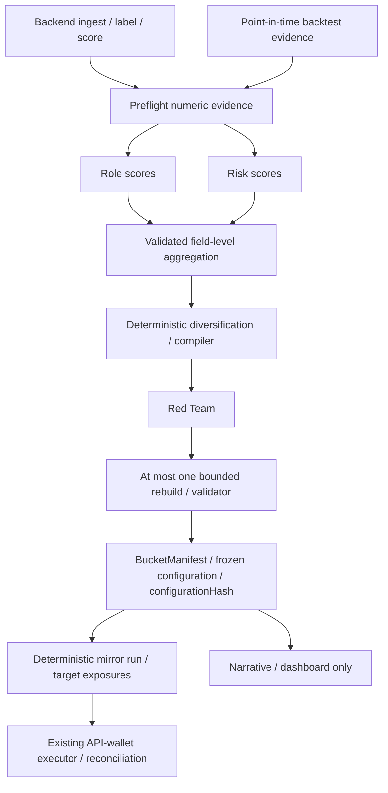

# Agent architecture v1

Status: design contract for the server-side review core; this is not deployed trading
code. See [integration guide](INTEGRATION.md) and
[production integration status](PRODUCTION_INTEGRATION.md) for implemented behavior
and outstanding gates. The initial design was drafted against baseline
`0f07e229028c84d62caecf00d1e842adc774a9e8`; the current branch also contains the
backend score/snapshot service, shared contracts, the mirror run (backend targets plus
executor) and the dashboard. Their presence and local tests do not establish a
real-provider review run, production deployment, or funded execution.

## Decisions and precedence

This contribution refines README §4.6 and resolves its weight-output question:
LLMs judge; code allocates. In case of conflict, this document governs the proposed
agent integration. It does not silently change the README's execution design.

Three decision specialists: Role Analyst, Risk Auditor, Red-Team Critic. A fourth
Narrative Agent explains validated results outside the economic path. Role and Risk
receive the same numeric evidence independently and never see each other's output.
Red Team gets the constructed portfolio in fresh context. There is no agent chat,
memory, dynamic delegation, execution agent or inference in the 10-minute loop.

~25 scored finalists become ~6–10 preflight candidates when evidence permits;
these are targets, not a requirement to fill slots. Candidate indices are internal.
The trusted backend keeps index→address mapping bound to snapshotHash; addresses,
names, descriptions, bios, dates in prose, and arbitrary strings never reach decision
agents. Strict schemas reject extra properties rather than relying on prompt obedience.
Hashes are identifiers, not a proof that backend metrics are accurate. Backtest
cutoffs must precede every evaluation window; never feed future OOS results into a
historical selection. Current-snapshot survivorship must be disclosed.

## Proposed bucket policy

Live bucket: **Aggressive**, per README §4.3 (team decision 2026-10-06, replacing this
contribution's earlier Balanced-live proposal); Conservative and Balanced are computed in
simulation. This is configuration for a
future adapter, not permission to fund or trade. $10–20 runs are smoke checks only.
Conservative here is a low-risk **perp-copy simulation**. Lending/yield execution
from the README remains unresolved and outside this contract; unsupported vaults
cannot be relabeled as copyable HyperCore sources.

`bucket-policy.schema.json` deliberately requires calibrated limits. Do not invent
production defaults. Weight caps, leverage, cash, correlation, overlap, confidence,
rejection and rebuild thresholds are deterministic, versioned and policy-hashed.
Each bucket is compiled under its own limits, not just an AI-chosen scalar.
The existing slice formula, active-source renormalization, $10 / 10% drift gates,
asset eligibility, reduce-only behavior, ledger reconciliation and IOC execution
remain module responsibilities. The validator must stress active-source
renormalization: flat sources can amplify the others beyond nominal weight caps.

Execution-fit starting hypothesis: exclude median hold <60 minutes; strong penalty
60–180, softer penalty 180–360, little/no latency penalty above 360. Missing holding
period is insufficient evidence, not a zero penalty. Calibrate penalty values and
capacity after netting eligible assets, drift and minimum order checks using replay.
A profitable source with 20-minute holds must still be excluded. No count of sources
alone proves executable capacity.

## Source-selection methodology crosswalk

[LockOn's tracking-address selection description](https://docs.lockon.finance/en/product/index/selection-of-tracking-addresses-for-index)
is a useful design comparison, not a validated PerpParrot parameter set. It separates
eligibility filters from a weighted, factor-based ranking, considers more than one
performance horizon, and turns each selected address's weight into its underlying
asset composition. Apply those ideas at the boundaries below:

- Keep hard eligibility and comparative ranking distinct. PerpParrot's $10k account
  value, 30-day history, 10-trade and 25-point requirements are eligibility gates;
  its month-window Sortino, Calmar, drawdown and PnL-consistency percentiles order the
  surviving cohort. Review risk limits remain binding even when a source ranks well.
- Treat the current score as cohort-relative. Adding or removing eligible candidates
  can change percentiles without changing a source's own record. Preserve raw metrics,
  score version, input window and cohort/snapshot hash with each result; never present
  the percentile score as an absolute probability of future profit or safety.
- Consider multi-horizon evidence only after the ingest contract can produce aligned,
  point-in-time windows. A shorter recent window can detect decay while a longer one
  adds context, but arbitrary 1-year/3-month weights cannot be imported from another
  product. Evaluate each proposed factor and weight in walk-forward replay, including
  regime slices and survivorship controls, before changing the score contract.
- Do not reward raw transaction count or account size as skill. Count is presently an
  eligibility/data-coverage gate; account value is a minimum evidence/capacity gate.
  High churn can be wash-like or impossible to copy after the 10-minute delay, and
  larger TVL alone does not establish edge. Use trade-pattern flags, holding-time and
  execution-fit evidence as risk/copyability checks, with missing evidence failing
  closed where policy requires it.
- Keep address selection separate from portfolio construction. LockOn's address
  breakdown idea has a direct analogue in `computeExposures`: source weights are
  multiplied by each source's signed per-asset notional/equity, then netted and capped.
  This is already the correct downstream shape for index replication. Correlation,
  vault/leader links, overlap, active-source renormalization and per-source ceilings
  must still constrain the portfolio; normalized score shares alone are not a safe
  weight policy.

Before adopting additional factors or changing weights, add point-in-time replay cases
for a deteriorating recent window, shallow-history/high-return sources, equal metrics
under different candidate cohorts, churn-heavy sources, capital-size changes, and
correlated sources with overlapping assets. Compare selected sets and post-cap asset
exposures against the current baseline. Keep the current score unchanged until that
evaluation is reproducible; this crosswalk does not authorize a live-set or policy
change.

## Module adapters (preserve README §4.12)

| Existing module | Additive boundary | Existing output preserved |
|---|---|---|
| ingest / score | Backend projects numeric metrics and trusted kind enums | snapshots / candidates |
| backtest | Past-cut evidence and provenance feed preflight; evaluate selections separately | backtests per OOS window |
| review | Frame → Role/Risk → diversification → compiler → Red Team → validator | reviews / buckets / freeze hash |
| positions | Uses resolved manifest source addresses and frozen weights | snapshot API |
| mirror | Reads only VALID frozen configuration + fresh state; zero inference | run snapshot + target exposures |
| execute | Existing configurationHash/account check, run claim, nonce, signing, IOC, reconciliation | orders / fills / ledger |
| paper / dashboard | Render modes and Narrative separately | paper_books / read-only UI |

Adapters must preserve existing table/API shapes once implementations exist. Do not
rename `review` to `curate` externally. `CandidateCurationFrame` and consensus are
internal review inputs. `BucketManifest` is the resolved downstream handoff.
`RebalanceReport` is the original contract's order-intent shape; the running mirror
instead serves target exposures (`GET /targets/:runAt`) that the executor sizes and
plans itself. Neither is a Hyperliquid exchange request.

## Consensus and failure state machine

All agents emit JSON only. Validate each observation before aggregation. Reject
unknown/duplicate/missing candidate IDs, mismatched snapshot/policy/prompt/model
hashes, nonfinite values and incomplete vectors. Do not median candidate IDs or
hashes. Agree identity exactly, sort by candidate, aggregate numeric fields using
median, then revalidate. For even observation counts use the mean of the middle
values and round risk/rejection scores upward and suitability/confidence scores downward; multipliers stay numeric. Quorum must be
configured for the actual set of model observations (today one provider node,
quorum 1), never inferred from an LLM-provided count. The orchestrator attaches
aggregation provenance; models return only result rows.

Risk scores become CAP / WATCHLIST / REJECT, a binding constraint and allocation
ceiling through policy code. Choose the largest of drawdown, leverage, concentration,
path and execution risk as binding, with stable lexicographic tie-breaking. Evidence
risk remains in the audit but is not a veto or allocation cap; uncertainty is
expressed through confidence. The pipeline review policy requires minimum Role/Risk
confidence of 40 and ranks by bucket fit × latency factor × minimum confidence / 100.
Weights normalize these scores and then obey risk caps; unused allocation stays cash.
Essential measured evidence checks remain mandatory. Correlation, linked vault/leader exposure and current overlap
are checked separately; low historical correlation does not prove diversification.

Red Team emits numeric rebuild/exclusion scores and multipliers. Code thresholds
them into PASS / REBUILD and exclude flags. Multipliers are in [0.5,1]; exclusions
set effective weight to zero. Apply penalties once to original compiler inputs,
not recursively to an already penalized portfolio. Recheck every constraint after
renormalization. Constraint tightening is deferred in v1: no open-ended policy edits.

Role/Risk or Red-Team timeout, malformed output or insufficient quorum → no new
portfolio. PASS still requires deterministic validation. REBUILD → one recompilation
→ validator; failure → INVALID_BUCKET with empty sources and cashWeight=1.
No second AI loop or silent fallback. An invalid selected bucket cannot authorize
new trades. After go-live review is commentary only; it cannot replace the frozen
manifest. Failure does not automatically flatten existing positions: Pause/Flatten
remain explicit executor controls. Mirror stale/mismatched state → NO_TRADE.
Uncertain execution → reconcile by cloid; never blind resend or switch transports.

## Aggregation, hashing and signing boundaries

Several observations of the same model provide sampling robustness, not independent
investment opinions or removal of shared bias. Role/Risk separation provides
independent context. Two-model backtest comparison remains an offline experiment:
pin prompt, model configuration, policy and data cut, then shadow-track the loser.
Do not mix model outputs in one aggregated vector.

The review runs server-side (`packages/backend/scripts/review-run.ts`), not in the
10-minute loop. Budget one compact evidence build, one Role call, one Risk call and
one Red-Team call per run; multiple bucket critiques must be batched. Rebuild is
deterministic and adds no model call. Measure serialized request and response sizes
against the provider's limits rather than encoding them in prompts.

Hash JSON with RFC 8785 canonicalization and Keccak-256 over UTF-8 canonical
`{domain,payload}`, excluding its own hash field. Shared commitment helpers implement
this exact format.
Do not claim JSON.stringify is canonical. Bind snapshotHash to sanitized frame
content (excluding snapshotHash) **and** trusted index/address mapping; use the
same domain convention for policy/manifest/configuration and log prompt/model hashes.
Self-reported hashes must be independently recomputed. Reject semantic mismatches,
expiry before creation, stale input, wrong mode/account, duplicate sources/assets,
weights outside caps or weights+cash !=1 (explicit numeric tolerance), nonpositive
order sizes/prices, and NO_TRADE results containing orders. Require VALID to have
reason OK, matching nested bucket/mode, and only Aggressive eligible for LIVE in v1.
These are adapter semantic checks; JSON Schema alone cannot enforce them.

Each mirror run binds its evidence to the frozen configuration: the executor rejects
targets whose configurationHash or account differs from its pinned
FROZEN_CONFIGURATION_HASH and HL_ACCOUNT, and records `{snapshotHash,
configurationHash, exposures}` with the run so anyone can fetch the snapshot and
recompute its keccak256.

Signer holds only an approved HL API wallet, never the master key. Keep the
configuration check, per-run claim, atomic nonce ownership, kill switch, allowed
assets and exposure checks in execute. [HL nonce/API-wallet guidance](https://hyperliquid.gitbook.io/hyperliquid-docs/for-developers/api/nonces-and-api-wallets)
is the integration reference. Deterministic cloid, expiry and reconciliation remain
required. No signing rewrite, automatic transport failover after uncertainty, key
migration or executor refactor is part of this contribution.

## Implementation gates

1. Adopt schemas with strict runtime validation and semantic checks in shared.
2. Build deterministic compiler/validator against replay fixtures before model calls.
3. Run prompt evals and a real-provider review run; then connect the review adapter.
4. Prove frozen-configuration mirror behavior and existing executor runs unchanged.
5. Only then integrate receipts and decide how reviews are scheduled (Vercel Cron or AWS).

No live capital, leverage settings, source reselection, orders or deployment changes
are made by this documentation/contracts contribution.
