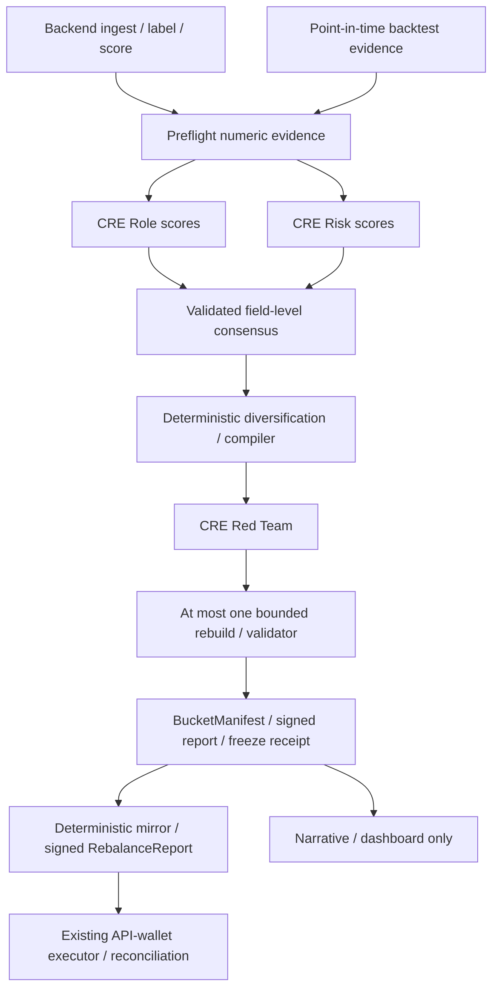

# Agent / CRE architecture v1

Status: additive design contract, not deployed trading code. The repository at base
`0f07e229028c84d62caecf00d1e842adc774a9e8` contains only README.md. No existing
TypeScript API, database schema, SDK version or executor implementation is available
to validate. These files define the next integration boundary, not a claim that
CRE simulation or live trading passed.

## Decisions and precedence

This contribution refines README §4.6 and resolves its weight-output question:
LLMs judge; code allocates. In case of conflict, this document governs the proposed
agent integration. It does not silently change the README's execution design.

Three decision specialists: Role Analyst, Risk Auditor, Red-Team Critic. A fourth
Narrative Agent explains validated results outside the economic path. Role and Risk
receive the same numeric evidence independently and never see each other's output.
Red Team gets the constructed portfolio in fresh context. There is no agent chat,
memory, dynamic delegation, execution agent or inference in the 10-minute loop.

~25 scored finalists become ~6–10 preflight candidates when evidence permits;
these are targets, not a requirement to fill slots. Candidate indices are internal.
The trusted backend keeps index→address mapping bound to snapshotHash; addresses,
names, descriptions, bios, dates in prose, and arbitrary strings never reach decision
agents. Strict schemas reject extra properties rather than relying on prompt obedience.
Hashes are identifiers, not a proof that backend metrics are accurate. Backtest
cutoffs must precede every evaluation window; never feed future OOS results into a
historical selection. Current-snapshot survivorship must be disclosed.

## Proposed bucket policy

The agreed demo plan supersedes README §4.3's Aggressive-live plan: Balanced live
with a proposed $150–250 allocation and a separate execution/margin buffer;
Conservative and Aggressive computed in simulation. This is configuration for a
future adapter, not permission to fund or trade. $10–20 runs are smoke checks only.
Conservative here is a low-risk **perp-copy simulation**. Lending/yield execution
from the README remains unresolved and outside this contract; unsupported vaults
cannot be relabeled as copyable HyperCore sources.

`bucket-policy.schema.json` deliberately requires calibrated limits. Do not invent
production defaults. Weight caps, leverage, cash, correlation, overlap, confidence,
rejection and rebuild thresholds are deterministic, versioned and policy-hashed.
Balanced is compiled under its own limits, not just an AI-chosen scalar.
The existing slice formula, active-source renormalization, $10 / 10% drift gates,
asset eligibility, reduce-only behavior, ledger reconciliation and IOC execution
remain module responsibilities. The validator must stress active-source
renormalization: flat sources can amplify the others beyond nominal weight caps.

Execution-fit starting hypothesis: exclude median hold <60 minutes; strong penalty
60–180, softer penalty 180–360, little/no latency penalty above 360. Missing holding
period is insufficient evidence, not a zero penalty. Calibrate penalty values and
capacity after netting eligible assets, drift and minimum order checks using replay.
A profitable source with 20-minute holds must still be excluded. No count of sources
alone proves executable capacity.

## Module adapters (preserve README §4.12)

| Existing module | Additive boundary | Existing output preserved |
|---|---|---|
| ingest / score | Backend projects numeric metrics and trusted kind enums | snapshots / candidates |
| backtest | Past-cut evidence and provenance feed preflight; evaluate selections separately | backtests per OOS window |
| review | Frame → Role/Risk → diversification → compiler → Red Team → validator | reviews / buckets / freeze hash |
| positions | Uses resolved manifest source addresses and frozen weights | snapshot API |
| mirror | Reads only VALID frozen manifest + fresh state; zero inference | signed report + receipt hash |
| execute | Existing DON verification, nonce, signing, IOC, reconciliation | orders / fills / ledger |
| paper / dashboard | Render modes and Narrative separately | paper_books / read-only UI |

Adapters must preserve existing table/API shapes once implementations exist. Do not
rename `review` to `curate` externally. `CandidateCurationFrame` and consensus are
internal review inputs. `BucketManifest` is the resolved downstream handoff;
`RebalanceReport` describes the unsigned payload wrapped by a CRE report. It is not
itself a DON signature or a Hyperliquid exchange request.

## Consensus and failure state machine

All agents emit JSON only. Validate each observation before aggregation. Reject
unknown/duplicate/missing candidate IDs, mismatched snapshot/policy/prompt/model
hashes, nonfinite values and incomplete vectors. Do not median candidate IDs or
hashes. Agree identity exactly, sort by candidate, aggregate numeric fields using
median, then revalidate. For even observation counts use the mean of the middle
values and round score integers upward; multipliers stay numeric. Quorum must be
configured for the actual DON, never inferred from an LLM-provided count. The
orchestrator attaches consensus provenance; models return only result rows.

Risk scores become CAP / WATCHLIST / REJECT, a binding constraint and allocation
ceiling through policy code. Choose the largest dimension as binding, with stable
lexicographic tie-breaking. Low confidence or missing essential evidence cannot
increase a ceiling. Correlation, linked vault/leader exposure and current overlap
are checked separately; low historical correlation does not prove diversification.

Red Team emits numeric rebuild/exclusion scores and multipliers. Code thresholds
them into PASS / REBUILD and exclude flags. Multipliers are in [0.5,1]; exclusions
set effective weight to zero. Apply penalties once to original compiler inputs,
not recursively to an already penalized portfolio. Recheck every constraint after
renormalization. Constraint tightening is deferred in v1: no open-ended policy edits.

Role/Risk or Red-Team timeout, malformed output or insufficient quorum → no new
portfolio. PASS still requires deterministic validation. REBUILD → one recompilation
→ validator; failure → INVALID_BUCKET with empty sources and cashWeight=1.
No second AI loop or silent fallback. An invalid selected bucket cannot authorize
new trades. After go-live review is commentary only; it cannot replace the frozen
manifest. Failure does not automatically flatten existing positions: Pause/Flatten
remain explicit executor controls. Mirror stale/mismatched state → NO_TRADE.
Uncertain execution → reconcile by cloid; never blind resend or switch transports.

## CRE and signing boundaries

Same-model DON aggregation provides tamper-resistant structured judgments and
sampling robustness, not independent investment opinions or removal of shared bias.
Role/Risk separation provides independent context. Two-model backtest comparison
remains an offline experiment: pin prompt, model configuration, policy and data cut,
then shadow-track the loser. Do not mix model outputs in one consensus vector.

Before wiring the SDK, pin its version, prove strict structured responses and
aggregation in simulation, measure serialized bytes and run production-limit checks.
Current [CRE quotas](https://docs.chain.link/cre/service-quotas) are deployment
constraints, not constants in prompts. Budget one compact backend request, one Role
call, one Risk call, one Red-Team call per run; multiple bucket critiques must be
batched or split into workflows within actual quotas. Rebuild is deterministic and
adds no model call. Mirror spot-check count must fit remaining HTTP quota after
account and report delivery calls; README's ~10-source sampling is not guaranteed.
Use a deterministic snapshot-derived sample, not per-node unseeded randomness.

Report verification must bind manifest, snapshot, account, policy, intent hash,
expiry and approved workflow/environment. Hash JSON with RFC 8785 canonicalization
and Keccak-256 over a versioned domain plus payload, excluding its own hash field.
Do not claim JSON.stringify is canonical. Bind snapshotHash to sanitized frame
content (excluding snapshotHash) **and** trusted index/address mapping; use the
same domain convention for policy/manifest/report and log prompt/model hashes.
Self-reported hashes must be independently recomputed. Reject semantic mismatches,
expiry before creation, stale input, wrong mode/account, duplicate sources/assets,
weights outside caps or weights+cash !=1 (explicit numeric tolerance), nonpositive
order sizes/prices, and NO_TRADE reports containing orders. Require VALID to have
reason OK, matching nested bucket/mode, and only Balanced eligible for LIVE in v1.
These are adapter semantic checks; JSON Schema alone cannot enforce them.

Signer holds only an approved HL API wallet, never the master key. Keep DON
verification, report dedupe, atomic nonce ownership, kill switch, allowed assets and
exposure checks in execute. [HL nonce/API-wallet guidance](https://hyperliquid.gitbook.io/hyperliquid-docs/for-developers/api/nonces-and-api-wallets)
is the integration reference. Deterministic cloid, expiry and reconciliation remain
required. A proposed `ExchangeTransport` may later carry an already-signed envelope
through Confidential HTTP; no signing rewrite, automatic transport failover after
uncertainty, key migration or executor refactor is part of this contribution.

## Implementation gates

1. Adopt schemas with strict runtime validation and semantic checks in shared.
2. Build deterministic compiler/validator against replay fixtures before model calls.
3. Run prompt evals and CRE production-limit simulation; then connect review adapter.
4. Prove frozen-manifest mirror behavior and existing executor reports unchanged.
5. Only then integrate receipts and optional Confidential HTTP against installed SDK.

No live capital, leverage settings, source reselection, orders or deployment changes
are made by this documentation/contracts contribution.
