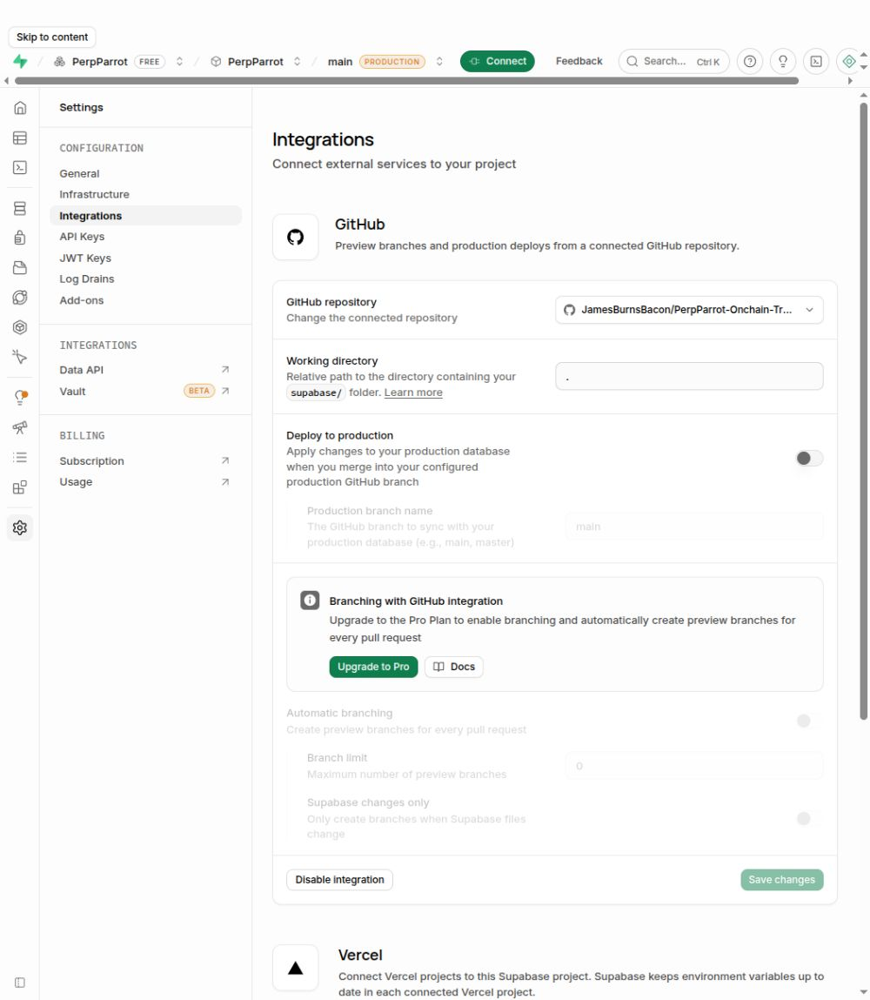

# Supabase and GitHub Connection Verification

**Result: PASS for the saved repository connection.** The exact target repository remained connected after reloading the Supabase integration page. Database deployment was not tested.

## Verification record

| Item | Value |
| --- | --- |
| Recorded at | `2026-10-06T15:19:53.397022+08:00` |
| Supabase project | PerpParrot |
| Project reference | `clheeepphmomkymawsfq` |
| Connected repository | `JamesBurnsBacon/PerpParrot-Onchain-Trading-Agent-by-QuantFun` |
| Repository main commit at inspection | `8192f2fc429dd2bdc64f7797bef119a5ccbcd6c8` |
| Documentation branch | `docs/supabase` |

The documentation branch is separate from the integration's stored production branch, `main`.

## Procedure and observed results

1. **Repository access:** Opened the Supabase repository picker after the repository owner's authorization. The exact target repository was available.
2. **Configuration:** Selected the target repository with working directory `.`. Turned off **Deploy to production**. **Automatic branching** remained off.
3. **Save:** Selected **Enable integration**. The page then displayed **Disable integration** and **Save changes**.
4. **Persistence check:** Reloaded the page. Read the full selected repository name from the repository control and checked the saved settings again.
5. **Evidence:** Captured the settings screenshot and recorded the exact repository and configuration in JSON.

## Acceptance criteria

| Check | Result |
| --- | --- |
| Exact target repository selected after reload | PASS |
| Integration enabled; Disable integration control present | PASS |
| Working directory remains `.` | PASS |
| Stored branch remains `main` | PASS |
| Deploy to production remains off | PASS |
| Automatic branching remains off | PASS |
| Save changes is disabled with no pending edits | PASS |

## Saved evidence

The screenshot truncates the long repository name visually. The [configuration record](evidence/connection-verification.json) preserves the full name read from the selected repository control. It also includes the screenshot's SHA-256 checksum for file integrity. These are recorded dashboard observations, not a deployment log or a provider-signed attestation.

## Verification boundary

This report proves the configured project-to-repository association at the recorded time. Automatic production deployment and preview branching are off. No database migration, deployment run, application connection, or database write/readback was performed for this verification. The inspected repository root contained `README.md` and `docs`, without a `supabase/` configuration directory.

To repeat the check, open [the project integration settings](https://supabase.com/dashboard/project/clheeepphmomkymawsfq/settings/integrations), reload the page, and compare the exact repository and settings with the criteria above. Keep any later deployment test in a separate report tied to a specific commit and database result.
